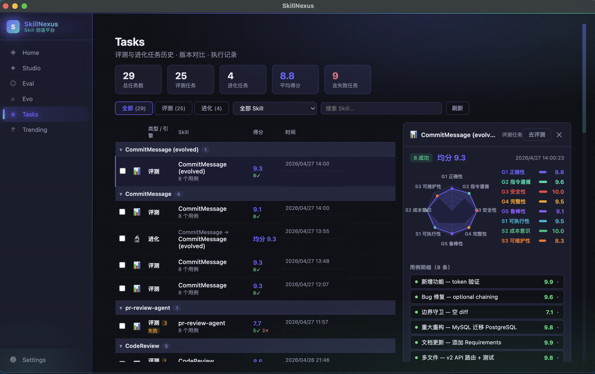
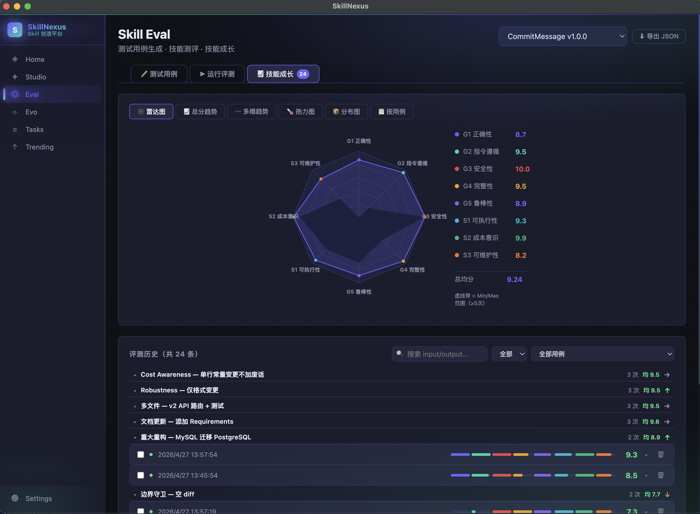
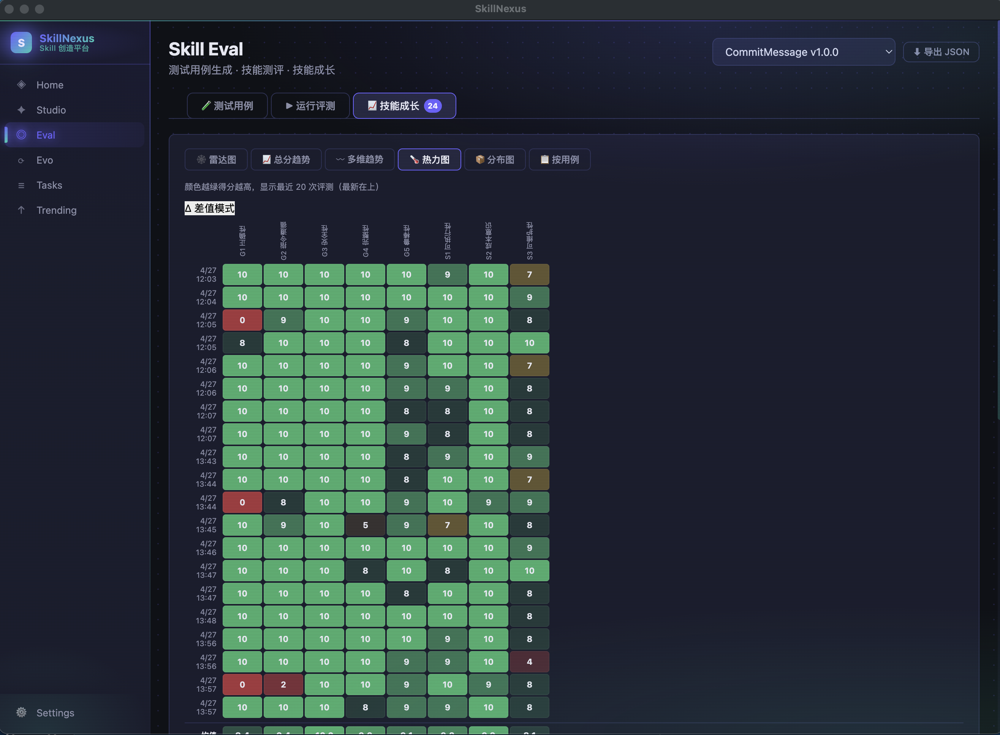
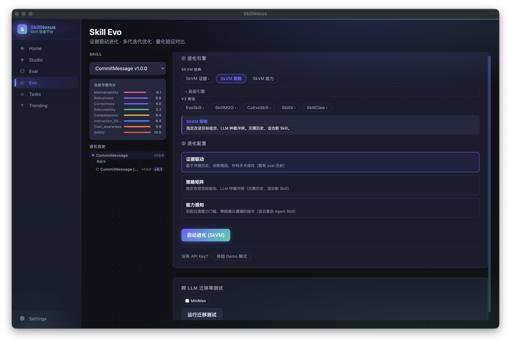
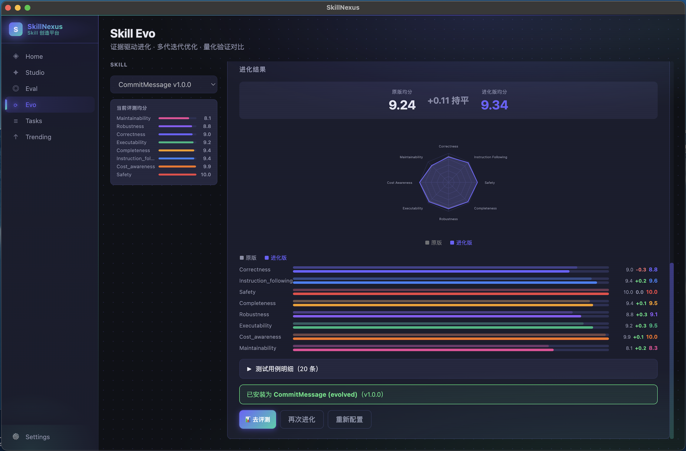
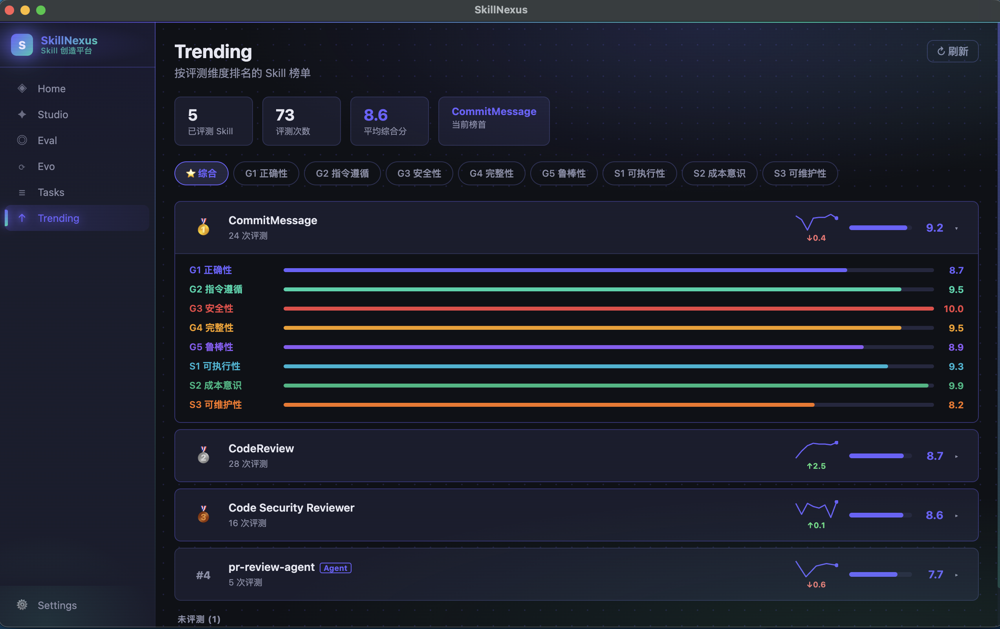

<div align="center">


# SkillNexus

**Skill Studio：The Full-Lifecycle AI Skill Studio**

*Make AI skills measurable, manageable, and evolvable*

[](LICENSE)
[](package.json)
[](#)
[](https://electronjs.org)
[](#)

[中文文档](README.zh.md) · [Blog](https://skyseraph.github.io) · [Series](https://skyseraph.github.io/series/skill-nexus/)

</div>

---

## What is SkillNexus[Skill Studio]?

**SkillNexus** is a full-lifecycle studio for AI Skills — from generation to evaluation to evolution. You're not just writing prompts／skill; you're systematically cultivating and growing AI capabilities.

```
Home (Manage) 
    → Studio (Generate) 
    → TestCase (Create) → Eval (Assess) 
    → Evo (Evolve) 
    → Trending (Rank)
```

A **Skill** is a modular capability unit following the [Agent Skills open standard](https://agentskills.io): a directory with a `SKILL.md` file (Markdown + YAML frontmatter). Skills install to `~/.claude/skills/` and are auto-discovered by Claude Code, Cursor, Windsurf, Gemini CLI, and other AI tools.


---

## ✨ Features

### 🏠 Home — Skill Management

- Install local Skill directories (`SKILL.md` + linked files) or single `.md` files (legacy format)
- **GitHub Marketplace** one-click search & install
- Scan & import from 12+ AI tool directories (Claude Code, Cursor, Windsurf, Gemini CLI…)
- Export to AI tools via symlink or file copy
- File tree browser with content preview
- Evolution chain visualization (lineage via `parent_skill_id`)



---

### 🎨 Studio — Skill Generation

**4 generation modes:**

| Mode | Description |
|------|-------------|
| 📝 Prompt-based | Describe your need, stream-generate a complete Skill |
| 📋 Example-based | Provide input/output pairs, AI generalizes a Skill |
| 💬 Chat extraction | Distill a Skill from conversation history |
| ✏️ Manual editing | Write or refine directly |

- Inline 5D quality validation (safety / completeness / executability / maintainability / cost awareness)
- Similarity detection to prevent duplicates
- Quick test: run Skill inline and save test cases
- Side-by-side comparison of original vs. evolved


---

### 🧪 TestCase — Test Suite Management

- Manual CRUD for test cases
- AI batch generation (1–20 cases, NDJSON streaming)
- 3 judge types: `llm` · `grep` · `command`

---

### 📊 Eval — 8-Dimension Evaluation Engine

Two groups: Task Quality (G-series) and Skill Quality (S-series):

| Dimension | Group | Description |
|-----------|-------|-------------|
| G1 · Correctness | Task | Did the output correctly accomplish the goal? |
| G2 · Instruction Following | Task | Were format and constraints followed precisely? |
| G3 · Safety | Task | Is the output safe, neutral, and harmless? |
| G4 · Completeness | Task | Are all necessary parts covered? |
| G5 · Robustness | Task | How well does it handle edge/ambiguous inputs? |
| S1 · Executability | Skill | Are the Skill's instructions clear and actionable? |
| S2 · Cost Awareness | Skill | Is the output concise and token-efficient? |
| S3 · Maintainability | Skill | Is the Skill structure clear and easy to update? |

**3 eval modes:** single · compare (A vs B) · three-condition (no-skill baseline vs current vs AI-generated)






---

### 🧬 Evo — Multi-Strategy Evolution Engine

**Studio interactive (streaming):**

| Paradigm | Strategy |
|----------|----------|
| `evidence` | Surgical fixes driven by eval evidence |
| `strategy` | Strategy matrix with user-defined objectives |
| `capability` | Capability-aware compilation for lower execution barrier |

**Automated SDK engines:**

| Engine | Core Idea |
|--------|-----------|
| **EvoSkill** | Worst-sample-driven iteration |
| **CoEvoSkill** | Generator–Verifier co-evolution loop |
| **SkillX** | Extract & encode success patterns from high-score history |
| **SkillClaw** | Cluster repeated failure patterns across sessions |
| **SkillMOO** | Multi-objective Pareto optimization (quality vs. cost) |

**Plugin system:** drop a `.js` file into `{userData}/plugins/` to add a custom engine — no source changes needed.





---

### 🏆 Trending — Leaderboard

- Rank all Skills by total score or individual dimensions
- Aggregated from eval history in real time
- Discover high-quality Skills to guide evolution direction



---

### ⚙️ Settings — LLM Provider

13 preset providers plus fully custom baseURL. API keys stored encrypted, never exposed to the renderer.

| Category | Providers |
|----------|-----------|
| Official | Anthropic |
| China Official | MiniMax (CN/Global) · DeepSeek · Kimi · Zhipu GLM · ByteDance · Alibaba · Baidu |
| Aggregator | OpenRouter |
| Local | Ollama |
| Custom | Any baseURL + API Key |

---

## 🏗️ Architecture

```
┌─────────────────────────────────────────────────────────────┐
│                  Renderer (React 18)                         │
│     Home · Studio · Eval · Evo · Trending · Settings         │
└─────────────────────┬───────────────────────────────────────┘
                      │ contextBridge (secure isolation)
┌─────────────────────▼───────────────────────────────────────┐
│                  Main Process (Node.js)                       │
│  ┌──────────┐  ┌──────────────┐  ┌───────────────────────┐  │
│  │ SQLite   │  │ electron-    │  │   AI Provider         │  │
│  │  (DB)    │  │ store(config)│  │   13 presets          │  │
│  └──────────┘  └──────────────┘  └───────────────────────┘  │
│                                                              │
│  ┌──────────────────────────────────────────────────────┐   │
│  │  Evolution SDK (zero Electron dependency)             │   │
│  │  BaseEvolutionEngine ← IDataStore / ISkillStorage /  │   │
│  │                        IProgressReporter             │   │
│  └──────────────────────────────────────────────────────┘   │
└─────────────────────────────────────────────────────────────┘
```

---

## 🔒 Security

**7 IPC Security Invariants** — violating any one blocks merges:

| Rule | Requirement |
|------|-------------|
| SEC-R1 | File paths validated against `assertPathAllowed()` whitelist |
| SEC-R2 | `name` params sanitized with `basename` before file writes |
| SEC-R3 | `config:get` returns `AppConfigPublic` — no `apiKey` field |
| SEC-R4 | `shell.openExternal` only accepts `https?://` |
| SEC-R5 | All AI calls wrapped with `withTimeout(30s)` |
| SEC-R6 | `testCaseIds` array length ≤ 50 |
| SEC-R7 | `skills:readFile` verifies file is within Skill's `rootDir` |

---

## 🛠️ Tech Stack

| Layer | Technology |
|-------|------------|
| Desktop | Electron 31 + electron-vite 2.3 |
| Frontend | React 18 + TypeScript 5.5 |
| Business DB | better-sqlite3 11 (SQLite) |
| Config store | electron-store 8 (encrypted) |
| AI SDK | @anthropic-ai/sdk 0.39, OpenAI-compatible via baseURL |
| Tests | Vitest 2 (693 tests, 38 suites) |
| Linting | ESLint + @typescript-eslint |

---

## 🚀 Quick Start

### Prerequisites

- Node.js 18+
- npm

### Install

```bash
git clone https://github.com/skyseraph/SkillNexus.git
cd SkillNexus
npm install
npm run rebuild   # rebuild native modules for Electron
```

### Dev

```bash
npm run dev
```

### Build

```bash
npm run build
```

### Test

```bash
npm test             # run once
npm run test:watch   # watch mode
```

---

## 📁 Project Structure

```
SkillNexus/
├── src/
│   ├── main/                    # Electron main process
│   │   ├── db/                  # SQLite schema & migrations
│   │   ├── ipc/                 # IPC handlers (per module)
│   │   └── services/
│   │       ├── ai-provider/     # AIProvider abstraction (13 presets)
│   │       ├── sdk/             # Evolution engine SDK (zero Electron deps)
│   │       │   ├── base-engine.ts
│   │       │   ├── evoskill-engine.ts
│   │       │   ├── coevoskill-engine.ts
│   │       │   ├── skillx-engine.ts
│   │       │   ├── skillclaw-engine.ts
│   │       │   └── skillmoo-engine.ts
│   │       └── adapters/        # Platform adapters (IDataStore / ISkillStorage / IProgressReporter)
│   ├── renderer/src/
│   │   ├── pages/               # 7 pages: Home Studio Eval Evo Trending Tasks Settings
│   │   └── components/
│   ├── preload/                 # contextBridge API surface
│   └── shared/                  # Shared types (main ↔ renderer)
├── tests/                       # Pure-logic test suites (no Electron/DB)
│   ├── security/
│   ├── eval/
│   ├── evo/
│   └── ...
├── docs/
├── example/plugins/             # Example custom evolution plugins
├── openspec/                    # Spec-first development docs
│   ├── specs/                   # Permanent feature specs
│   └── changes/                 # Active change proposals
└── CLAUDE.md                    # Project guidelines & coding principles
```

---

## 📝 Blog Series

A 10-part series on SkillNexus, from hands-on usage to technical internals.

| # | Article |
|---|---------|
| 01 | [Your Skill Directory Is Turning Into a Mess](https://skyseraph.github.io/series/skill-nexus/01-why-skill-nexus.md) |
| 02 | [First Skill Evaluation in 5 Minutes — Getting Started](https://skyseraph.github.io/series/skill-nexus/02-quickstart.md) |
| 03 | [From One Line to a Working Skill — Studio's 5 Creation Modes](https://skyseraph.github.io/series/skill-nexus/03-studio.md) |
| 04 | [8-Dimension Eval Framework: Turning "Feels OK" into Data](https://skyseraph.github.io/series/skill-nexus/04-eval.md) |
| 05 | [Evolution Engine: Making Skills Automatically Better](https://skyseraph.github.io/series/skill-nexus/05-evo.md) |
| 06 | [Trending: Your Skill Asset Map](https://skyseraph.github.io/series/skill-nexus/06-trending.md) |
| 07 | [Architecture: Electron Dual-Process + Zero-Dependency Evolution SDK](https://skyseraph.github.io/series/skill-nexus/7-architecture.md) |
| 08 | [Current State & Roadmap: What's Next for SkillNexus](https://skyseraph.github.io/series/skill-nexus/08-roadmap.md) |
| 09 | [Eval Reports Beyond a Quick Glance — Offline Report System](https://skyseraph.github.io/series/skill-nexus/09-offline-report.md) |
| 10 | [Visualization Design: Why Skill Evaluation Needs 6 Chart Types](https://skyseraph.github.io/series/skill-nexus/10-visualization.md) |

---

## 🤝 Contributing

1. Fork → create feature branch
2. **Spec-First**: write a Spec under `openspec/specs/` before implementing
3. `npm test` must pass
4. Follow the 7 IPC Security Invariants
5. Submit Pull Request

See [CLAUDE.md](CLAUDE.md) for the Spec-First workflow and Karpathy coding principles.

---

## 📄 License

[Apache License 2.0](LICENSE)

---

## 🙏 Acknowledgments

- [Andrej Karpathy](https://github.com/karpathy) — coding principles inspiration
- [Claude Code](https://claude.ai/code) — AI-assisted development
- [agent-skill-autonomous](https://skyseraph.github.io/posts/2026/agent-skill-autonomous/) — theoretical foundation

---

<div align="center">

**Made with ❤️ · [Author Blog](https://skyseraph.github.io) · [Report Bug](https://github.com/skyseraph/SkillNexus/issues) · [Request Feature](https://github.com/skyseraph/SkillNexus/issues)**

</div>
