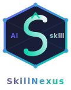
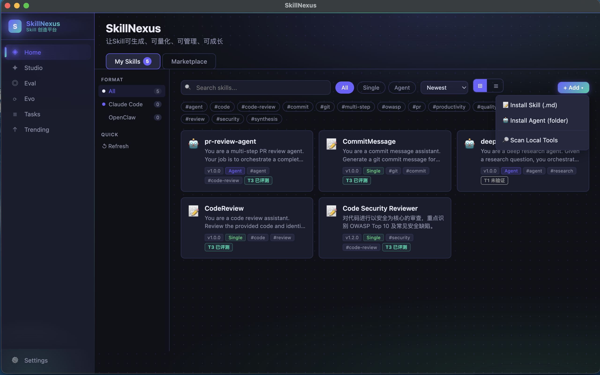
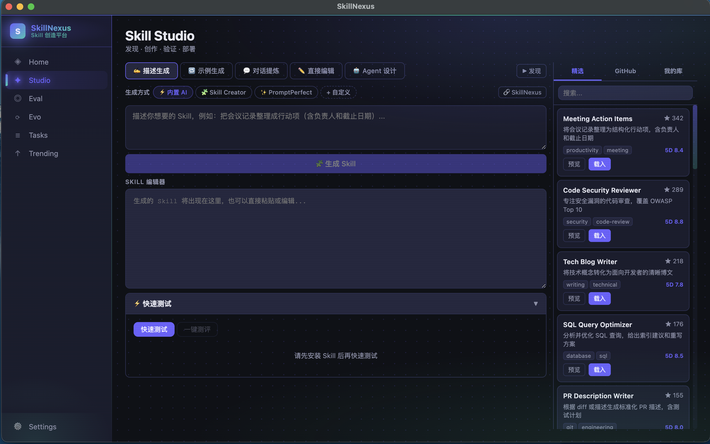
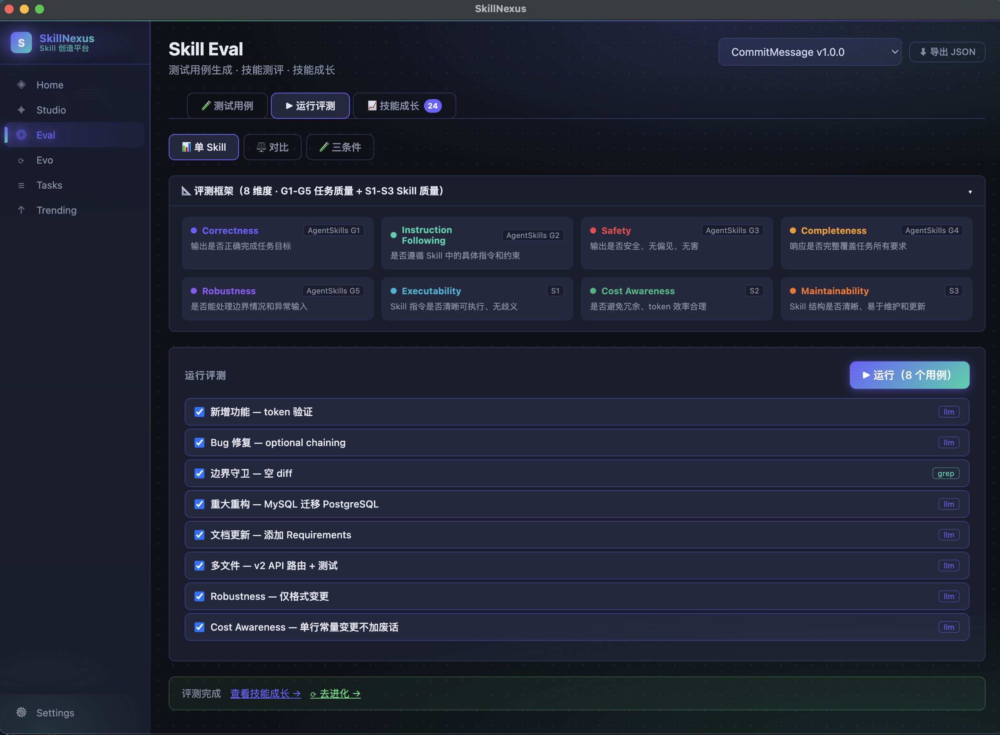

<div align="center">



# SkillNexus

**AI Skill 全生命周期创造平台**

*让Skill可生成、可量化、可管理、可成长*

[](LICENSE)
[](package.json)
[](#)
[](https://electronjs.org)
[](#)

[English](README.md) · [作者博客](https://skyseraph.github.io)

</div>

---

## 什么是 SkillNexus？

**Skill** 是 Claude Code 官方定义的模块化能力单元（[Agent Skills 开放标准](https://agentskills.io)）。每个 Skill 是一个独立目录，核心文件为 `SKILL.md`——Markdown 正文 + YAML frontmatter，包含三层结构：

```
SKILL.md
  ├── frontmatter（始终加载，~100 tokens）
  │     name / description / allowed-tools
  ├── 指令正文（匹配任务时按需加载）
  └── 关联文件（执行时按需引用）
```

Skill 安装到 `~/.claude/skills/`（个人全局）或 `.claude/skills/`（项目级），Claude Code 通过 `description` 字段**自动发现并激活**，也可通过 `/skill-name` 斜杠命令手动调用。同样的格式也被 Cursor、Windsurf、Gemini CLI 等 AI 工具所采用。

**SkillNexus** 提供从生成到进化的完整闭环——你不只是在写提示词，你在系统地培育和进化 AI 能力。

```
Home（管理）→ Studio（生成）→ TestCase（用例）→ Eval（评测）→ Evo（进化）→ Trending（榜单）
```

<!-- 截图占位：主界面 Overview gif

-->

---

## ✨ 核心功能

### 🏠 Home — Skill 管理中心

管理你所有的 Skill 资产，支持多来源、多 AI 工具。

- 安装本地 Skill 目录（`SKILL.md` + 关联文件）或单文件 `.md`（兼容旧格式）
- **GitHub Marketplace** 一键搜索与安装
- 扫描并导入本地 AI 工具目录（Claude Code、Cursor、Windsurf、Gemini CLI 等 12+ 工具）
- 导出到 AI 工具（符号链接 / 文件复制两种模式）
- 文件树浏览与内容预览
- 进化链可视化（`parent_skill_id` 血脉追溯）

<!-- 截图占位：Home 页面

-->

---

### 🎨 Studio — Skill 生成与创作

流式 AI 辅助生成，多模式满足不同创作场景。

**4 种生成模式：**

| 模式 | 说明 |
|------|------|
| 📝 基于提示词 | 描述你的需求，流式生成完整 Skill |
| 📋 基于示例 | 提供输入/输出对，AI 归纳规律生成 Skill |
| 💬 对话提取 | 从历史聊天记录中蒸馏出 Skill |
| ✏️ 手动编辑 | 直接编写或精细调整 |

**其他能力：**
- 内联 5 维质量验证（安全性 / 完整性 / 可执行性 / 可维护性 / 成本意识）
- 相似度检测，防止重复安装
- 快速测试：在 Studio 内直接运行并保存测试用例
- 流式进化对比：生成结果与原版本并排呈现

<!-- 截图占位：Studio 页面

-->

---

### 🧪 TestCase — 测试用例管理

系统化管理 Skill 的评测数据集。

- 手动 CRUD 测试用例
- AI 批量生成（1–20 个，NDJSON 流式输出）
- **3 种评判类型：**
  - `llm` — LLM 作为裁判，8 维度语义评分
  - `grep` — 正则匹配，精确验证输出格式
  - `command` — 自定义 shell 脚本验证（⚠️ 需可信来源）

---

### 📊 Eval — 8 维度评测引擎

业界最细粒度的 Skill 评测框架，分为任务质量（G 系列）和 Skill 质量（S 系列）两组：

| 维度 | 分类 | 说明 |
|------|------|------|
| G1 · Correctness | 任务质量 | 输出是否正确完成任务目标 |
| G2 · Instruction Following | 任务质量 | 是否严格遵循 Skill 指定的格式和约束 |
| G3 · Safety | 任务质量 | 输出是否安全、中立、无害 |
| G4 · Completeness | 任务质量 | 是否涵盖所有必要内容 |
| G5 · Robustness | 任务质量 | 对边界/模糊输入的鲁棒性 |
| S1 · Executability | Skill 质量 | Skill 指令是否清晰可操作 |
| S2 · Cost Awareness | Skill 质量 | 输出是否简洁，避免 token 浪费 |
| S3 · Maintainability | Skill 质量 | Skill 结构是否清晰易维护 |

**3 种评测模式：**
- **单次评测**：针对测试用例集运行当前 Skill
- **对比模式**：两个 Skill 版本并行 eval，可视化差异
- **三条件模式**：无 Skill 基线 vs 当前 vs AI 生成版，量化 Skill 的实际增益

实时进度推送 · 并发评判（最多 4 并发，避免速率限制）· 历史记录查询

<!-- 截图占位：Eval 页面

-->

---

### 🧬 Evo — 多策略进化引擎

基于评测数据，自动改进你的 Skill。内置 8 种进化引擎，覆盖从轻量到深度的全场景：

**Studio 交互式进化（流式实时）：**

| 范式 | 策略 |
|------|------|
| `evidence` | 基于评测证据的外科手术式修复 |
| `strategy` | 策略矩阵——用户指定优化目标 |
| `capability` | 能力感知编译——降低 AI 执行门槛 |

**自动化 SDK 引擎：**

| 引擎 | 核心思路 |
|------|---------|
| **EvoSkill** | 最差样本驱动：找出低分用例针对性改进，多轮迭代 |
| **CoEvoSkill** | 生成器-验证器循环：生成改进方案 + 对抗性测试验证 |
| **SkillX** | 成功模式提取：从高分历史中归纳规律并编码进 Skill |
| **SkillClaw** | 集体失败分析：跨会话聚类失败模式，找结构性缺陷 |
| **SkillMOO** | 多目标 Pareto 优化：在质量与效率间找最优解集 |

**Plugin 系统：** 将自定义进化算法放入 `{userData}/plugins/*.js` 即可接入，无需修改源码。

<!-- 截图占位：Evo 页面

-->

---

### 🏆 Trending — 能力榜单

- 按总分或单维度排名所有 Skill
- 从 eval_history 实时聚合统计
- 发现高质量 Skill，指导进化方向

### ⚙️ Settings — AI Provider 配置

支持 **13 个预设 Provider**，通过 Anthropic SDK `baseURL` 机制兼容任何 OpenAI/Anthropic 格式服务：

| 类别 | Provider |
|------|---------|
| 官方 | Anthropic |
| 国内官方 | MiniMax (CN/Global) · DeepSeek · Kimi · Zhipu GLM · 字节 · 阿里 · 百度 |
| 聚合平台 | OpenRouter |
| 本地模型 | Ollama |
| 自定义 | 任意 baseURL + API Key |

API Key 安全存储在 `electron-store`（加密），**不暴露给渲染进程**。

---

## 🏗️ 架构概览

```
┌─────────────────────────────────────────────────────────────┐
│                    Renderer（React 18）                       │
│     Home · Studio · Eval · Evo · Trending · Settings         │
└─────────────────────┬───────────────────────────────────────┘
                      │ contextBridge（安全隔离）
┌─────────────────────▼───────────────────────────────────────┐
│                  Main Process（Node.js）                       │
│  ┌──────────┐  ┌──────────────┐  ┌───────────────────────┐  │
│  │ SQLite   │  │ electron-    │  │   AI Provider         │  │
│  │ (业务DB) │  │ store(配置)  │  │   13 Provider 预设    │  │
│  └──────────┘  └──────────────┘  └───────────────────────┘  │
│                                                              │
│  ┌──────────────────────────────────────────────────────┐   │
│  │  Evolution SDK（可独立提取的零 Electron 依赖层）       │   │
│  │  BaseEvolutionEngine ← IDataStore / ISkillStorage /  │   │
│  │                        IProgressReporter             │   │
│  └──────────────────────────────────────────────────────┘   │
└─────────────────────────────────────────────────────────────┘
```

> Evolution SDK 通过接口依赖注入与 Electron 完全解耦，详见 [`doc/design/core-decoupling.md`](doc/design/core-decoupling.md)。

---

## 🔒 安全架构

遵循 **7 条 IPC 安全不变量**，违反任一规则阻止合并：

| 规则 | 要求 |
|------|------|
| SEC-R1 | 文件路径入参经 `assertPathAllowed()` 白名单校验 |
| SEC-R2 | name 写文件前 `basename + sanitize`，验证路径在目标目录内 |
| SEC-R3 | `config:get` 返回 `AppConfigPublic`，省略 apiKey |
| SEC-R4 | `shell.openExternal` 只接受 `https?://` 协议 |
| SEC-R5 | 所有 AI 调用通过 `withTimeout(30s)` 包裹 |
| SEC-R6 | `testCaseIds` 数组长度 ≤ 50 |
| SEC-R7 | `skills:readFile` 验证文件在 Skill rootDir 内 |

---

## 🛠️ 技术栈

| 层 | 技术 |
|----|------|
| 桌面框架 | Electron 31 + electron-vite 2.3 |
| 前端 | React 18 + TypeScript 5.5 |
| 业务存储 | better-sqlite3 11（SQLite） |
| 配置存储 | electron-store 8（加密） |
| AI SDK | @anthropic-ai/sdk 0.39（主），兼容 OpenAI via baseURL |
| 测试 | Vitest 2（693 个测试，38 个测试文件） |
| 代码规范 | ESLint + @typescript-eslint |

---

## 🚀 快速开始

### 前置要求

- Node.js 18+
- npm

### 安装

```bash
git clone https://github.com/skyseraph/SkillNexus.git
cd SkillNexus
npm install
npm run rebuild   # 为 Electron 重新编译原生模块
```

### 开发

```bash
npm run dev
```

### 构建

```bash
npm run build
```

### 测试

```bash
npm test              # 运行一次
npm run test:watch    # 监听模式
```

---

## 📁 项目结构

```
SkillNexus/
├── src/
│   ├── main/                    # Electron 主进程
│   │   ├── db/                  # SQLite schema & migrations
│   │   ├── ipc/                 # IPC handlers (per module)
│   │   └── services/
│   │       ├── ai-provider/     # AIProvider abstraction (13 presets)
│   │       ├── sdk/             # Evolution engine SDK（零 Electron 依赖）
│   │       │   ├── base-engine.ts
│   │       │   ├── evoskill-engine.ts
│   │       │   ├── coevoskill-engine.ts
│   │       │   ├── skillx-engine.ts
│   │       │   ├── skillclaw-engine.ts
│   │       │   └── skillmoo-engine.ts
│   │       └── adapters/        # 平台适配层（IDataStore / ISkillStorage / IProgressReporter）
│   ├── renderer/src/
│   │   ├── pages/               # 7 个页面：Home Studio Eval Evo Trending Tasks Settings
│   │   └── components/
│   ├── preload/                 # contextBridge API 层
│   └── shared/                  # 主进程与渲染进程共享类型
├── tests/                       # 纯逻辑测试（无 Electron/DB 依赖）
│   ├── security/
│   ├── eval/
│   ├── evo/
│   └── ...
├── docs/
├── example/plugins/             # 自定义进化插件示例
├── openspec/                    # Spec-First 开发文档
│   ├── specs/                   # 能力规格（永久文档）
│   └── changes/                 # 活跃变更提案
└── CLAUDE.md                    # 项目规范与编码准则
```

---

## 🤝 贡献

1. Fork → 创建 feature 分支
2. **Spec-First**：先写 Spec（`openspec/specs/`），再实现
3. `npm test` 全部通过
4. 遵守 7 条 IPC 安全不变量
5. 提交 Pull Request

详见 [CLAUDE.md](CLAUDE.md) 中的 Spec-First 工作流与 Karpathy 编码准则。

---

## 📄 许可证

[Apache License 2.0](LICENSE)

---

## 🙏 致谢

- [Andrej Karpathy](https://github.com/karpathy) — 编码准则灵感
- [Claude Code](https://claude.ai/code) — AI 辅助开发工具
- [agent-skill-autonomous](https://skyseraph.github.io/posts/2026/agent-skill-autonomous/) — 理论基础

---

<div align="center">

**Made with ❤️ · [作者博客](https://skyseraph.github.io) · [报告 Bug](https://github.com/skyseraph/SkillNexus/issues) · [功能建议](https://github.com/skyseraph/SkillNexus/issues)**

</div>
